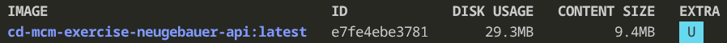
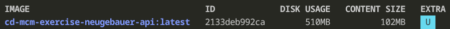
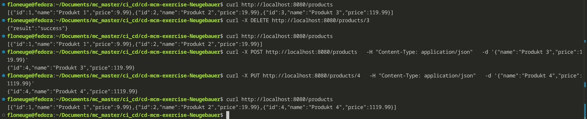
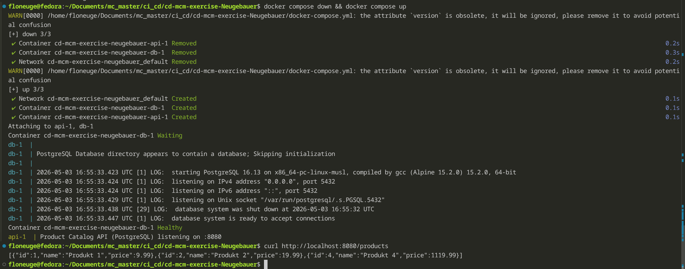
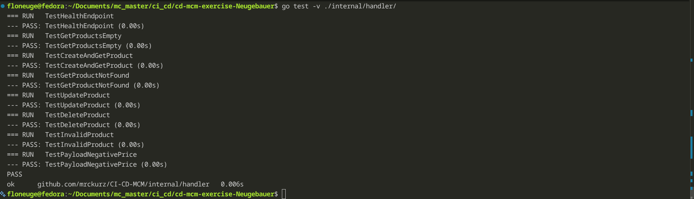

# Task 3: Dockerfile lines commented

```FROM golang:1.26-alpine AS builder```
Alpine versions are minimal low profile versions of Linux, which is why they are widely used for Docker images. Here in this line, a specific version distributed by golang is used and given a name to be reusable later on. 

```WORKDIR /app```
The working/root directory for this Dockerfile is switched to /app. As far as I know, this also creates the folder but I have not checked this assumption.

```COPY go.mod go.sum ./```
Copies two files used for dependencies into the working directory.


```RUN go mod download```
Downloads dependencies, if the container is (re-)built or if the requirements in the files of the previous layer changed. 

If nothing is changed in go.mod or go.sum and the Dockerfile does not receive any new layers in front, layer caching prevents this line from being run again, as it has not changed itself and previous steps stayed the same as well.

```COPY . .```
Similar to before - if there are changes in the file system, they are copied. If there are no changes, this is skipped.

```RUN CGO_ENABLED=0 GOOS=linux go build -o /api-server ./cmd/api```
This is the final build step of this stage. First, two environment variables are set that impact the build process, then the build is started, using "cmd/api" as the entrypoint. The -o(utput) flag sets the name for the compiled object to "api-server".

By default, CGO_ENABLED is set to 1 and therefore enabled. Some GO-functions are available as C equivalents depending on the library present on the OS where the binaries are built. If CGO is enabled, those native equivalents are linked and used instead of the GO-functions, which means an OS with different C-libraries than the OS that built the binaries would not be able to run those.

GOOS sets the target to Linux, as GO supports cross compilation. In combination with disabling CGO, the build will be able to run on any Linux distro.


```FROM alpine:3.19```
This is the start of a new stage based on a different alpine version. The previous stage will be discarded after the Dockerfile has run through because of this line right here. 

```RUN apk --no-cache add ca-certificates```
Apk is alpine's package manager. no-cache makes sure that no repo package indexing is saved in the Docker layer to keep everything small. add ca-certificates gets certificates that are necessary to receive http requests.

```WORKDIR /app```
Just like the workdir layer above.

```COPY --from=builder /api-server .```
Copies the build files created in the previous stage into the new current stage under /app/api-server.

```EXPOSE 8080```
Simply says "this container uses port 8080.".

```ENTRYPOINT ["./api-server"]```
I believe this sets an entry point that is started automatically every time the container is started. In this case, it is the binary copied two steps before this.

After this, all previous stages are discarded and the docker container only consists of the extremely small alpine and the code compiled in the previous build stage but without all the megabytes of build dependencies from that image.

# Task 3: CGO_ENBALED=0
By default, CGO_ENABLED is set to 1 and therefore enabled. Some GO-functions are available as C equivalents depending on the library present on the OS where the binaries are built. If CGO is enabled, those native equivalents are linked and used instead of the GO-functions, which means an OS with different C-libraries than the OS that built the binaries would not be able to run those.

GOOS sets the target to Linux, as GO supports cross compilation. In combination with disabling CGO, the build will be able to run on any Linux distro.

# Task 3: Size comparison
## Multi Stage

## Single Stage


# Task 3: Testing
- List afer three products were created
- Delete
- Recreation of third product to still have 3+ products
- Update third product

- Docker down && up => products still exist


# Task 4: Handler Tests
